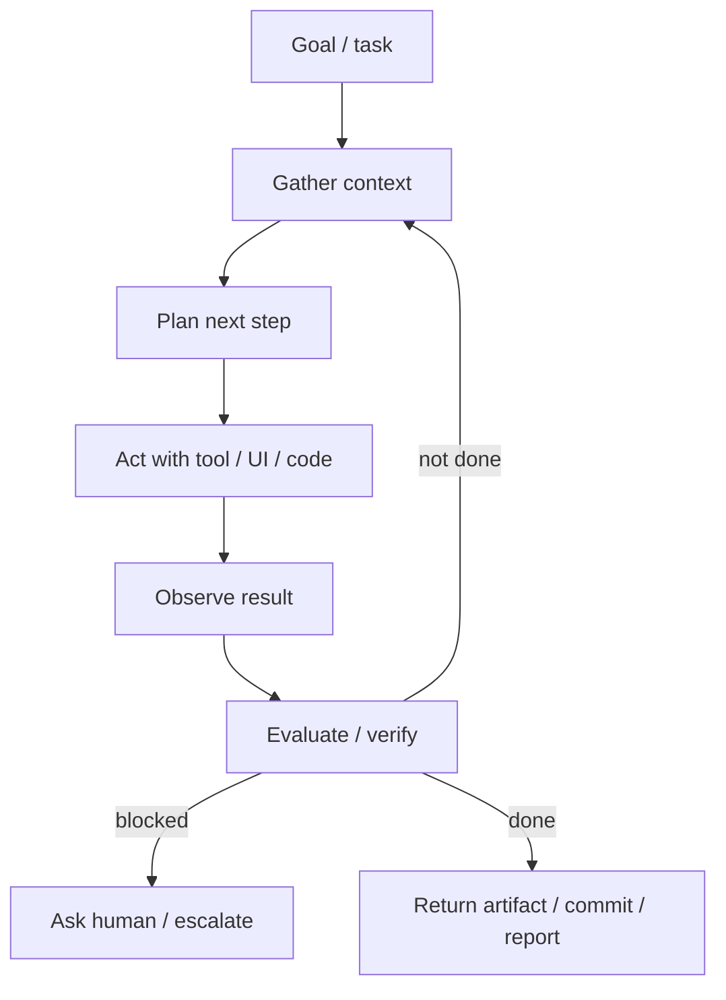
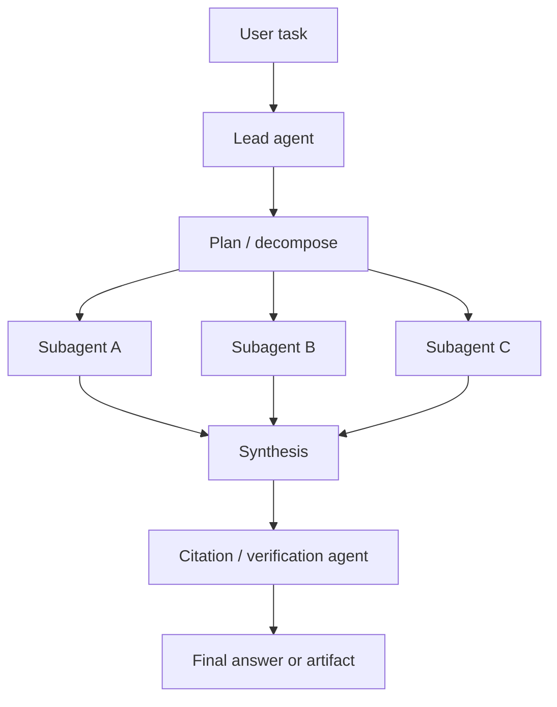

# 02 — Technical Architecture of Agentic AI

Last updated: 2026-05-22 IST

## 1. The canonical agent loop

Most working agents implement some form of this loop:

Simple agents hide this loop inside an SDK. Stronger systems expose parts of it so engineers can control state, permissions, retries, and evaluation.

## 2. Core components

### Reasoning model

The model interprets the goal, decomposes work, chooses tools, and synthesizes results. Reasoning-first models improved long-horizon tasks because they spend more computation on planning and self-correction.

### Tool layer

Tools are typed actions: search, read file, write file, run command, send email, query database, call CRM API, create ticket, update calendar, etc. Tool quality often matters more than prompt quality.

Good tools are:

- Narrow and explicit.
- Typed with schemas.
- Idempotent when possible.
- Permission-aware.
- Observable in logs.
- Designed with dry-run or preview modes.

### Memory and context

Memory can mean several different things:

- Short-term task state: current plan, observations, intermediate artifacts.
- Retrieval context: documents, code, tickets, policies, knowledge bases.
- Long-term user or organization memory: preferences, prior work, stable facts.
- Episodic traces: previous runs and outcomes.

Memory is powerful but dangerous. If untrusted content can persist into future decisions, memory poisoning becomes a real threat.

### Orchestration runtime

The runtime decides how to run the loop: single agent, graph, queue, workflow engine, multi-agent team, sandbox, retries, timeouts, approvals, and tracing.

### Verification layer

Verification turns agents from plausible to useful. Examples:

- Unit tests and type checks for coding agents.
- State checks after API calls.
- Browser DOM assertions.
- Schema validation for outputs.
- Human review for irreversible steps.
- LLM-as-judge only when calibrated and audited.

## 3. Agent interfaces: APIs vs computer use

Two main action styles are emerging.

### API/tool-first agents

The agent calls structured tools. This is safer and easier to govern.

Advantages:

- Clear permissions.
- Easier logs.
- Easier testing.
- Lower brittleness.
- Better for enterprise systems.

Disadvantages:

- Requires APIs and integration work.
- Misses long-tail workflows only available through GUIs.

### Computer/browser-use agents

The agent sees pixels/DOM/accessibility trees and uses mouse/keyboard.

Advantages:

- Works with software that lacks APIs.
- Human-observable and transferable across sites.
- Can cover the long tail of digital tasks.

Disadvantages:

- Brittle UIs.
- Harder access control.
- Harder verification.
- Captchas/login/anti-bot issues.
- Higher risk from untrusted web content.

The likely future is hybrid: use APIs where available and safe; use computer control for long-tail gaps; require human approval for high-risk actions.

## 4. Multi-agent systems

Multi-agent systems use multiple LLM agents, often with an orchestrator-worker pattern.

Anthropic reported that its multi-agent research system, using Claude Opus 4 as lead and Claude Sonnet 4 subagents, outperformed a single-agent Claude Opus 4 by 90.2% on an internal research evaluation. The same post also warns that multi-agent systems are expensive: agents used about 4x more tokens than chat interactions, and multi-agent systems about 15x more tokens than chats.

Multi-agent works best when:

- The task is broad and decomposable.
- Subtasks are independent.
- The value of better coverage exceeds the token cost.
- Synthesis can compress findings reliably.

Multi-agent works poorly when:

- All agents need the same shared context.
- Subtasks are tightly sequential.
- Coordination overhead dominates.
- Evaluation is unclear.

## 5. Framework landscape

Common frameworks and their typical fit:

| Framework / SDK | Best fit | Notes |
|---|---|---|
| LangGraph | Stateful, graph-based workflows | Strong when explicit state, loops, branches, and recovery paths matter. |
| LangChain | Broad tool/retrieval ecosystem | Often paired with LangGraph; large integration surface. |
| LlamaIndex | RAG-heavy agents | Strong data connectors, indexing, retrieval, document synthesis. |
| CrewAI | Role-based multi-agent prototypes | Fast mental model: agents as a team with roles and tasks. |
| AutoGen | Conversational multi-agent research/workflows | Flexible agent-to-agent dialogue, human-in-loop patterns. |
| Semantic Kernel / Microsoft Agent Framework | Microsoft/.NET/Azure enterprise stacks | Enterprise integration and plugin model. |
| OpenAI Agents SDK | OpenAI-native loops, handoffs, guardrails, tracing, sessions, sandbox agents | Few primitives: agents, handoffs, guardrails. |
| Claude Agent SDK | Computer/tool-using agents based on Claude Code loop | Strong for filesystem/terminal/search/edit/verify workflows. |
| Pydantic AI | Type-safe Python agents | Useful where schemas and validation are central. |

Framework choice should follow the dominant constraint:

- Retrieval problem -> LlamaIndex or retrieval layer plus orchestrator.
- Complex state machine -> LangGraph.
- Role-based business process -> CrewAI.
- Conversational/human-in-loop research -> AutoGen.
- Microsoft enterprise -> Semantic Kernel / Microsoft Agent Framework.
- Vendor-native sandboxed agents -> OpenAI Agents SDK or Claude Agent SDK.

## 6. Design patterns that work

### Plan -> execute -> verify

The agent creates a plan, executes bounded steps, and verifies each step before continuing.

### Narrow tools over broad tools

Prefer `create_refund_request(order_id, amount, reason)` over `run_arbitrary_sql` or unrestricted browser access.

### Preview before commit

Generate drafts, diffs, dry-runs, or staged actions before irreversible operations.

### Human-on-the-loop

Humans do not need to approve every step; they need to approve high-impact, ambiguous, or irreversible steps.

### Isolated workspaces

Coding/data agents should work in sandboxes with explicit file, network, and credential boundaries.

### Observability by default

Every run should produce traceable records: prompt, tool call, parameters, outputs, state transitions, approvals, and final result.

## 7. Common failure modes

- Tool loops: repeatedly trying the same failed action.
- Context rot: using stale or irrelevant retrieved context.
- Overbroad permissions: agent can do more than task requires.
- Hidden state mismatch: agent thinks an action succeeded but external state differs.
- Evaluation leakage: benchmark or tests can be gamed.
- Prompt injection: untrusted content changes instructions.
- Memory poisoning: malicious content persists across sessions.
- Coordination failures: agents duplicate work or propagate errors.

The engineering challenge is to design agents as reliable distributed systems, not as magical prompts.
