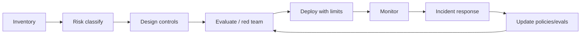

# 05 — Security, Governance, and Risks

Last updated: 2026-05-22 IST

## 1. Why agent security is different

Traditional LLM risk often meant bad text output. Agentic risk means bad actions.

An agent can:

- Read private data.
- Call tools.
- Send messages.
- Modify files.
- Trigger payments.
- Change permissions.
- Browse untrusted web pages.
- Store memory for future use.
- Coordinate with other agents.

This turns prompt injection from an annoying jailbreak into an application-security vulnerability.

## 2. Main threat categories

| Threat | Description | Example impact |
|---|---|---|
| Direct prompt injection | User asks agent to ignore rules. | Unauthorized action if controls rely only on prompt. |
| Indirect prompt injection | Agent reads malicious text from email/web/doc/tool output. | Data exfiltration or action hijack. |
| Tool misuse | Agent uses allowed tool in unsafe way. | Refunds, deletes, sends, or changes records incorrectly. |
| Confused deputy | Agent has authority the attacker lacks and is tricked into using it. | External email causes internal data leak. |
| Memory poisoning | Malicious content persists in memory/retrieval. | Future decisions compromised. |
| Retrieval poisoning | RAG corpus contains adversarial instructions or false facts. | Wrong answer or action. |
| Credential/secret leakage | Agent reads or outputs secrets. | API keys, tokens, confidential docs exposed. |
| Excessive agency | Too much autonomy or too broad permissions. | Unbounded side effects. |
| Multi-agent contagion | One compromised agent influences others. | Cascading failures. |
| Protocol/tool poisoning | Tool descriptions or MCP-like metadata contain malicious instructions. | Agent calls tools with attacker-shaped behavior. |

## 3. EchoLeak as a warning sign

The EchoLeak case study describes CVE-2025-32711, a zero-click prompt injection vulnerability in Microsoft 365 Copilot. According to the paper, a crafted email could cause data exfiltration by chaining prompt-injection filter bypass, markdown/link redaction bypass, auto-fetched images, and a Microsoft Teams proxy allowed by content security policy.

The general lesson is not limited to one vendor:

- Enterprise copilots bridge external inputs and internal data.
- If the model can read untrusted content and access trusted data, trust boundaries blur.
- Output channels can become exfiltration channels.
- Defenses must be layered: prompt partitioning, provenance-based access control, output filtering, restrictive CSP, monitoring, and adversarial testing.

## 4. OWASP 2025 agentic AI security themes

OWASP's State of Agentic AI Security and Governance report highlights:

- Agentic AI introduces a new threat surface due to autonomy, reasoning, memory, and tool access.
- Key risks include memory poisoning, tool misuse, prompt injection, and insider threats.
- Security must move from traditional controls to proactive defense-in-depth across development, testing, and runtime.
- Important safeguards include fine-grained access control, runtime monitoring, lifecycle governance, and real-time oversight.

## 5. Design principles for secure agents

### Least privilege

Agents should only get the tools, data, and scopes needed for the current task. Avoid default access to email, files, browser, terminal, and production APIs together.

### Separate data and instructions

Untrusted content should be treated as data, not as authority. This is hard to solve fully, but prompt partitioning and structured tool boundaries help.

### Constrain after untrusted input

A useful security rule from prompt-injection design-pattern research:

> Once an LLM has ingested untrusted input, it should be constrained so that the untrusted input cannot trigger consequential actions.

Patterns include plan-then-execute, quarantined summarization, untrusted-data processors without side-effect tools, and fixed action plans.

### Human approval for consequential actions

Require approval for:

- External sends.
- Financial actions.
- Permission changes.
- Deletions.
- Legal/compliance-sensitive outputs.
- Large data exports.
- Actions involving credentials or personal data.

### Sandboxing

Run code, browser sessions, and file operations in restricted environments. Limit network egress. Use throwaway credentials where possible.

### Provenance-based access control

Decisions should account for where information came from. An external email should not be allowed to cause an agent to fetch and transmit internal documents.

### Action allowlists and deny-by-default tools

Only expose tools needed for the workflow. Tools should validate parameters and enforce policy server-side, not rely on the model to behave.

### Observability and replay

Every action should be logged with:

- User request.
- System/developer instructions version.
- Retrieved context and sources.
- Tool calls and arguments.
- Tool outputs.
- Approvals.
- Final result.
- Policy decisions.

## 6. Governance model

Agent governance should cover the full lifecycle:

Key governance questions:

- What is the agent allowed to do?
- What data can it access?
- What actions require approval?
- Who owns the agent's failures?
- What logs are retained?
- How are prompts, tools, and models versioned?
- How are regressions detected?
- How can an agent be disabled quickly?

## 7. Risk-tiered autonomy

A practical autonomy ladder:

| Level | Autonomy | Example |
|---:|---|---|
| 0 | Suggest only | Draft response, no tools. |
| 1 | Read-only tools | Search docs, summarize tickets. |
| 2 | Draft actions | Prepare email/refund/PR but human submits. |
| 3 | Low-risk writes | Update labels, create draft tickets, run tests. |
| 4 | Conditional autonomy | Execute bounded actions under policy thresholds. |
| 5 | High autonomy | Multi-step actions across systems with monitoring and rollback. |

Most enterprise agents should start at levels 1-3 and earn autonomy through evidence.

## 8. Evaluation and red teaming

Security evaluations should test:

- Direct prompt injection.
- Indirect prompt injection through documents, emails, websites, comments, PDFs, images.
- Tool parameter manipulation.
- Data exfiltration through links, images, markdown, API calls, logs.
- Memory poisoning.
- Multi-agent propagation.
- Permission boundary violations.
- Unsafe retries and loops.
- Human approval habituation.

Task success alone is not enough. Measure:

- Benign success rate.
- Attack success rate.
- Severity-weighted harm.
- False-positive blocking.
- Latency overhead.
- Human review burden.

## 9. Compliance landscape

Relevant frameworks include:

- NIST AI Risk Management Framework.
- ISO/IEC 42001 for AI management systems.
- EU AI Act risk categories and obligations.
- SOC 2 / ISO 27001 for enterprise assurance.
- OWASP Top 10 for LLM Applications and agentic AI guidance.
- Sector-specific requirements: finance, healthcare, employment, education, critical infrastructure.

The hard part is that regulations often lag behind agent capabilities. Organizations need internal controls that are more specific than broad compliance language.

## 10. Security bottom line

The safest useful agents are not unrestricted general agents. They are constrained systems with:

- Narrow goals.
- Minimal privileges.
- Strong tools.
- Explicit policies.
- Runtime monitoring.
- Human approval where needed.
- Repeatable evaluations.
- Incident response.

Agent security is a systems problem, not a prompt-writing problem.
