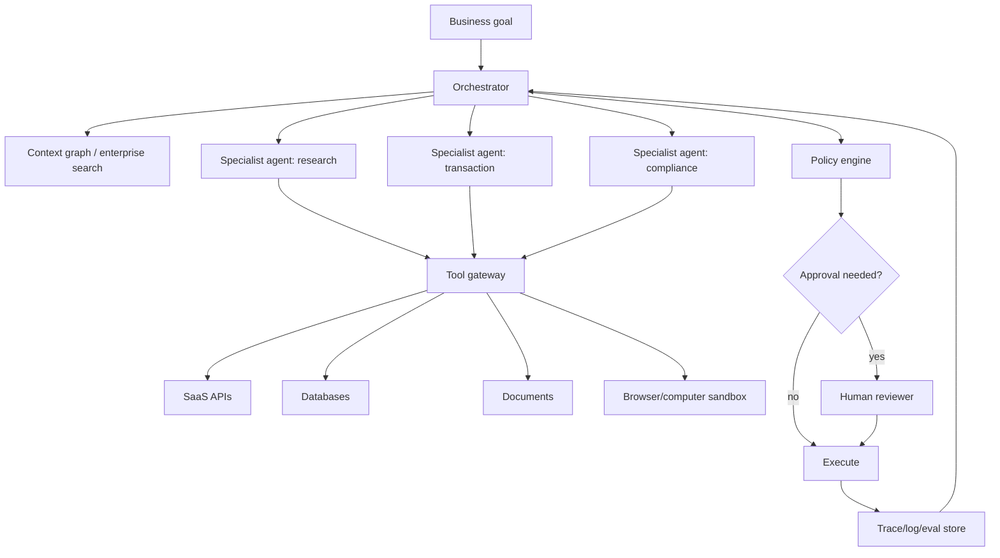

# 06 — Future Outlook for Agentic AI

Last updated: 2026-05-22 IST

## 1. Base-case forecast: 2026-2028

The likely near future:

1. Coding agents become standard developer infrastructure.
2. Research/data-analysis agents become common for knowledge workers.
3. Enterprise agents move from pilots to controlled production in IT, support, finance operations, and sales operations.
4. Browser/computer agents improve but remain supervised for high-risk actions.
5. Multi-agent systems are used selectively for high-value, parallelizable tasks.
6. Agent security becomes a major procurement and platform differentiator.
7. Benchmarks shift from task success to reliability, safety, cost, and governance.

## 2. Capability trajectory

### Short horizon: 0-12 months

Expected improvements:

- Better tool calling and structured outputs.
- Longer reliable task horizons.
- More robust coding agents with integrated CI loops.
- More vendor-native agent SDKs and sandboxes.
- Better tracing, replay, and eval tooling.
- More enterprise connectors via MCP-like protocols.
- More AI agents embedded in existing SaaS workflows.

Main constraint:

- Reliability under messy real-world context and adversarial inputs.

### Medium horizon: 12-36 months

Expected improvements:

- Agents complete multi-hour workflows with intermittent supervision.
- Agent-native business processes emerge rather than UI automation over old workflows.
- Personal/enterprise assistants maintain durable context across apps.
- Human managers supervise teams of agents.
- More physical-world agent pilots in robotics, logistics, and labs.
- Regulatory expectations harden around logging, approval, evaluation, and accountability.

Main constraint:

- Governance and organizational adaptation, not just model capability.

### Long horizon: 3-5 years

Possible developments:

- Agents act as a normal abstraction layer over software, similar to how search became a normal abstraction over the web.
- Agent marketplaces and tool ecosystems mature.
- Many SaaS products become systems of record plus agentic action layers.
- Human roles shift toward goal setting, judgment, exception handling, relationship work, and agent operations.
- Some organizations become substantially flatter and more automated.

Main uncertainty:

- Whether reliability, security, and liability frameworks improve fast enough for high-autonomy deployment.

## 3. What will differentiate winners

### For model labs

- Long-horizon reliability.
- Tool-use accuracy.
- Multimodal computer control.
- Cost efficiency for agentic workloads.
- Safety under prompt injection and tool misuse.
- Strong developer/runtime ecosystem.

### For agent platforms

- Secure connectors.
- Sandboxed execution.
- Observability and replay.
- Policy engines.
- Evaluation suites.
- Human-in-loop UX.
- Enterprise identity integration.
- Workflow redesign templates.

### For enterprises

- Clean data/context layer.
- API modernization.
- Strong IAM and least privilege.
- Cross-functional operating model.
- Risk-tiered autonomy.
- Continuous evaluation.
- Change management.

## 4. Likely architecture of future enterprise agents

The key pattern is not one omnipotent agent. It is a controlled system: orchestrator, context, policy, specialist agents, tool gateway, approvals, and logs.

## 5. Research problems that remain open

### Reliable long-horizon planning

Agents still drift, forget constraints, or pursue suboptimal paths over long tasks.

### Grounded memory

How should agents remember useful facts without preserving poisoned or stale context?

### Secure tool use

How can we guarantee untrusted input cannot cause unauthorized side effects?

### Evaluation validity

How do we build benchmarks that cannot be gamed and reflect real-world success?

### Cost control

Reasoning and multi-agent systems can consume many tokens. Future systems need dynamic budgets and cheaper verification.

### Human-agent interaction

How should humans delegate, interrupt, correct, audit, and trust agents without either micromanaging or overtrusting?

### Multi-agent coordination

How do agents share state, avoid duplicated work, prevent error cascades, and resolve disagreements?

### Liability and accountability

Who is responsible when an autonomous system causes harm: user, deployer, model provider, tool provider, or data source?

## 6. Scenario analysis

### Optimistic scenario

By 2028, agents reliably handle a large fraction of routine digital work. Coding, IT operations, customer support, finance operations, and research workflows see major productivity gains. Security architectures mature quickly, and humans focus on goals, review, and exceptions.

### Base scenario

Agents become common but bounded. They are powerful copilots and semi-autonomous workers in well-instrumented workflows. Fully autonomous broad agents remain risky. Enterprises that modernize data and governance pull ahead; others remain stuck in pilots.

### Pessimistic scenario

High-profile failures, data leaks, regulatory pressure, and poor ROI from poorly designed pilots slow deployment. Agents remain useful in coding/research but are heavily restricted in enterprise action workflows.

## 7. Practical advice for the next 12 months

If you are building or adopting agents:

1. Start with one workflow where success is measurable.
2. Use read-only or draft-only modes first.
3. Build the eval harness before increasing autonomy.
4. Give the agent narrow tools, not broad credentials.
5. Add logging and replay from day one.
6. Treat untrusted input as hostile.
7. Require approval for consequential actions.
8. Measure cost per successful outcome, not just demo quality.
9. Redesign the workflow instead of automating every old click.
10. Promote autonomy gradually based on evidence.

## 8. Final outlook

Agentic AI is likely to be one of the defining software shifts of the late 2020s. The near-term winners will not be the systems that appear most autonomous in demos; they will be the systems that are reliable, observable, governable, and economically useful.

The future is not a single all-powerful agent. It is a new computing layer where humans specify goals, agents operate tools, policies constrain actions, and organizations redesign work around hybrid human-agent teams.
