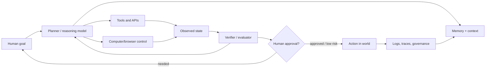

# Agentic AI: Current State and Future

Last updated: 2026-05-22 IST

This research pack summarizes the state of agentic AI as of 2025-2026: what agents are, what is working, where benchmarks show progress, why enterprise scaling is hard, what the security risks are, and what the next 12-36 months likely look like.

## Executive thesis

Agentic AI is moving from "chat that answers" to "software that pursues goals with tools." The most important shift is not just better language models; it is the combination of reasoning models, tool use, persistent context, computer/browser control, orchestration runtimes, guardrails, and human approval workflows.

The field is in a paradoxical state:

- Capability is improving extremely fast, especially in coding, research, browser use, and structured enterprise workflows.
- Production reliability is still uneven. Many demos work, but many enterprise deployments fail because old processes, data systems, permissions, and governance models were not designed for autonomous digital workers.
- Safety and security are now first-order architecture problems, not afterthoughts. Prompt injection, tool misuse, memory poisoning, and privilege escalation become more dangerous when an agent can act.

## File map

1. [01-current-state.md](01-current-state.md) — definitions, adoption, product landscape, capability trends.
2. [02-technical-architecture.md](02-technical-architecture.md) — components, agent loops, memory, tools, multi-agent systems, frameworks.
3. [03-benchmarks-and-capabilities.md](03-benchmarks-and-capabilities.md) — SWE-bench, WebArena, WorkArena, tau-bench, OSWorld, benchmark caveats.
4. [04-enterprise-adoption-and-economics.md](04-enterprise-adoption-and-economics.md) — enterprise use cases, ROI, operating models, blockers.
5. [05-security-governance-and-risks.md](05-security-governance-and-risks.md) — threat model, security controls, governance, compliance.
6. [06-future-outlook.md](06-future-outlook.md) — forecasts, likely winners, open research problems, scenarios.
7. [07-source-notes.md](07-source-notes.md) — source list and notes.

## One-screen mental model

## Quick takeaways

- "Agent" is an overloaded term. The useful definition is: an AI system that can plan and execute multi-step tasks using tools or environments, with some autonomy and feedback loops.
- The most mature current category is coding agents because coding has fast feedback: tests, compilers, linters, git diffs, CI, and clear artifacts.
- General browser/computer agents are improving but remain below human reliability on long-horizon tasks.
- Enterprise value depends less on sprinkling agents over existing workflows and more on redesigning workflows around agent-native data, permissions, observability, and escalation paths.
- Multi-agent systems are valuable when work is parallelizable and high-value, but they are expensive and harder to evaluate.
- Security requires least privilege, action gating, provenance, tool sandboxing, monitoring, evaluation, and incident response designed for autonomous systems.

## Suggested reading order

If you want the fastest path: read `01-current-state.md`, then `03-benchmarks-and-capabilities.md`, then `05-security-governance-and-risks.md`.

If you want to build agents: read `02-technical-architecture.md` and `05-security-governance-and-risks.md` first.

If you want strategy: read `04-enterprise-adoption-and-economics.md` and `06-future-outlook.md`.
