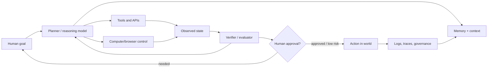
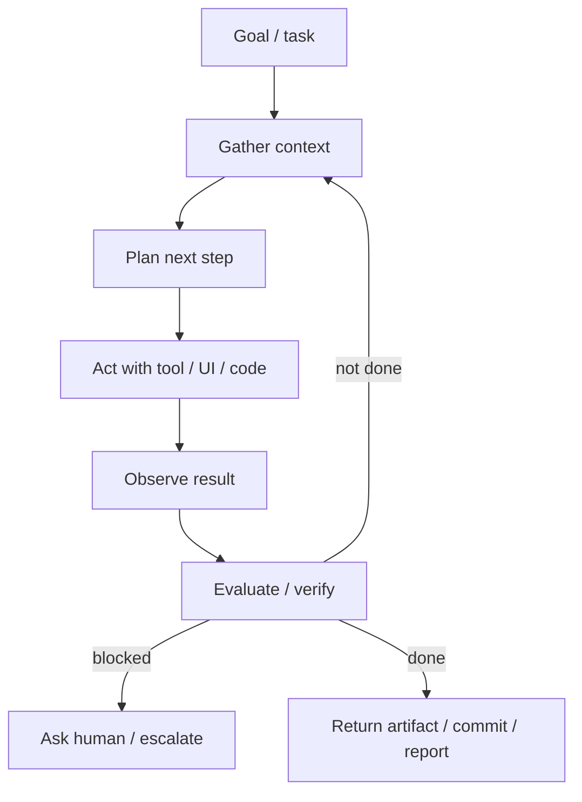
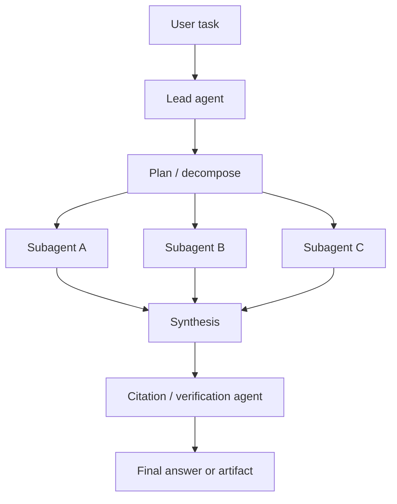
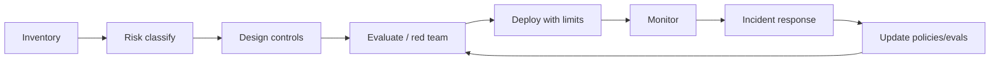
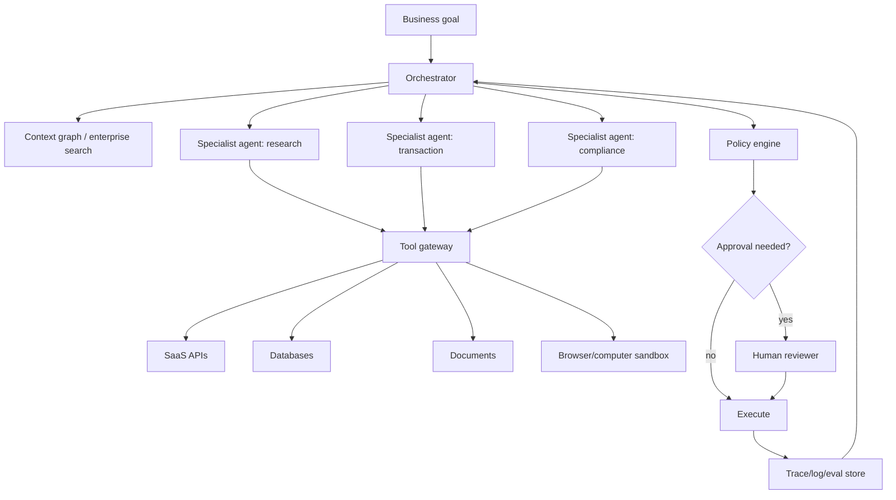

<!-- Combined from agentic-ai research pack. -->

<!-- BEGIN README.md -->

# Agentic AI: Current State and Future

Last updated: 2026-05-22 IST

This research pack summarizes the state of agentic AI as of 2025-2026: what agents are, what is working, where benchmarks show progress, why enterprise scaling is hard, what the security risks are, and what the next 12-36 months likely look like.

## Executive thesis

Agentic AI is moving from "chat that answers" to "software that pursues goals with tools." The most important shift is not just better language models; it is the combination of reasoning models, tool use, persistent context, computer/browser control, orchestration runtimes, guardrails, and human approval workflows.

The field is in a paradoxical state:

- Capability is improving extremely fast, especially in coding, research, browser use, and structured enterprise workflows.
- Production reliability is still uneven. Many demos work, but many enterprise deployments fail because old processes, data systems, permissions, and governance models were not designed for autonomous digital workers.
- Safety and security are now first-order architecture problems, not afterthoughts. Prompt injection, tool misuse, memory poisoning, and privilege escalation become more dangerous when an agent can act.

## File map

1. [01-current-state.md](01-current-state.md) — definitions, adoption, product landscape, capability trends.
2. [02-technical-architecture.md](02-technical-architecture.md) — components, agent loops, memory, tools, multi-agent systems, frameworks.
3. [03-benchmarks-and-capabilities.md](03-benchmarks-and-capabilities.md) — SWE-bench, WebArena, WorkArena, tau-bench, OSWorld, benchmark caveats.
4. [04-enterprise-adoption-and-economics.md](04-enterprise-adoption-and-economics.md) — enterprise use cases, ROI, operating models, blockers.
5. [05-security-governance-and-risks.md](05-security-governance-and-risks.md) — threat model, security controls, governance, compliance.
6. [06-future-outlook.md](06-future-outlook.md) — forecasts, likely winners, open research problems, scenarios.
7. [07-source-notes.md](07-source-notes.md) — source list and notes.

## One-screen mental model



## Quick takeaways

- "Agent" is an overloaded term. The useful definition is: an AI system that can plan and execute multi-step tasks using tools or environments, with some autonomy and feedback loops.
- The most mature current category is coding agents because coding has fast feedback: tests, compilers, linters, git diffs, CI, and clear artifacts.
- General browser/computer agents are improving but remain below human reliability on long-horizon tasks.
- Enterprise value depends less on sprinkling agents over existing workflows and more on redesigning workflows around agent-native data, permissions, observability, and escalation paths.
- Multi-agent systems are valuable when work is parallelizable and high-value, but they are expensive and harder to evaluate.
- Security requires least privilege, action gating, provenance, tool sandboxing, monitoring, evaluation, and incident response designed for autonomous systems.

## Suggested reading order

If you want the fastest path: read `01-current-state.md`, then `03-benchmarks-and-capabilities.md`, then `05-security-governance-and-risks.md`.

If you want to build agents: read `02-technical-architecture.md` and `05-security-governance-and-risks.md` first.

If you want strategy: read `04-enterprise-adoption-and-economics.md` and `06-future-outlook.md`.

<!-- END README.md -->

---

<!-- BEGIN 01-current-state.md -->

# 01 — Current State of Agentic AI

Last updated: 2026-05-22 IST

## 1. What "agentic AI" means

A practical definition:

> Agentic AI is an AI system that can pursue a goal through multiple steps by observing state, reasoning or planning, using tools, taking actions, and adapting based on feedback.

This separates agents from ordinary chatbots. A chatbot mostly returns text. An agent changes state: it edits files, books things, calls APIs, drives a browser, updates a CRM, runs tests, sends messages, or coordinates other agents.

Core properties:

- Goal-directed: works toward an outcome, not only a response.
- Tool-using: calls APIs, searches, writes files, runs code, controls browsers or computers.
- Feedback-driven: observes results, catches errors, retries or changes plan.
- Contextual: uses memory, retrieved documents, logs, prior actions, and task state.
- Bounded autonomy: may operate independently within configured permissions, then escalate.

## 2. Why agents accelerated in 2025

Several streams matured at the same time:

1. Reasoning models improved planning, decomposition, and self-correction.
2. Tool-use training became mainstream in frontier models.
3. Coding agents demonstrated that LLMs can complete real work when given a shell, editor, tests, and version control.
4. Browser/computer-use models learned to operate interfaces directly, not only APIs.
5. Frameworks and SDKs began standardizing loops, handoffs, guardrails, sessions, tracing, and sandboxing.
6. Enterprise buyers began moving from experimentation to workflow transformation.

OpenAI's Computer-Using Agent (CUA), introduced in January 2025, represents the browser/computer-control direction: it processes screenshots, reasons, and acts with a virtual mouse and keyboard. OpenAI reported 38.1% success on OSWorld, 58.1% on WebArena, and 87% on WebVoyager, while noting the gap to human performance on harder tasks.

OpenAI later introduced ChatGPT agent in July 2025, combining Operator-style web interaction, deep research synthesis, a terminal, browser tools, APIs, and connectors into one virtual-computer workflow.

Anthropic's Claude Code and Claude Agent SDK represent the "give the model a computer" direction: file access, bash, search, edit, verify, repeat. Anthropic describes a common loop: gather context -> take action -> verify work -> repeat.

Google's Gemini direction emphasizes a universal AI assistant and world-model framing: multimodal understanding, memory, computer control, Project Astra, and Project Mariner, including multiple browser agents working on tasks in parallel.

## 3. Adoption snapshot

Enterprise AI adoption is broad, but scaling agents is still early.

McKinsey's 2025 global survey reported:

- 88% of respondents say their organizations regularly use AI in at least one business function.
- 62% say their organizations are at least experimenting with AI agents.
- 23% say their organizations are scaling an agentic AI system somewhere in the enterprise.
- In any given business function, no more than 10% report scaling AI agents.
- Agent use is most commonly reported in IT and knowledge management.

Deloitte's 2026 Tech Trends article reports a similar production gap:

- 30% of surveyed organizations are exploring agentic options.
- 38% are piloting.
- 14% have solutions ready to deploy.
- 11% are actively using agentic systems in production.
- 42% are still developing an agentic roadmap and 35% have no formal strategy.

This suggests the industry has moved beyond pure curiosity, but not yet into broad operational maturity.

## 4. Product landscape

Major product categories:

| Category | Examples | Current maturity | Why it matters |
|---|---|---:|---|
| Coding agents | Claude Code, Codex-style agents, Cursor, Devin-like systems, OpenHands, SWE-agent | High relative maturity | Fast feedback loops make autonomy useful and measurable. |
| Research agents | ChatGPT deep research/agent, Claude Research, Perplexity-style systems | Medium-high | Parallel search and synthesis benefit from multi-agent breadth. |
| Browser/computer agents | Operator/CUA, Project Mariner, browser agents | Medium | Useful for long-tail tasks without APIs, but reliability and safety are hard. |
| Enterprise workflow agents | Salesforce, ServiceNow, Microsoft 365 Copilot agents, n8n/Zapier-style builders | Early-medium | Biggest economic prize, but integration/governance heavy. |
| Customer support agents | Tool/API agents with policy manuals | Medium | Clear workflows and escalation paths; high risk if permissions are broad. |
| Physical/robotic agents | Gemini Robotics, drones, humanoid prototypes | Early | Extends agentic AI into physical world; safety burden is much higher. |

## 5. What is actually working

The most reliable agent deployments tend to have:

- A narrow, valuable workflow.
- Clear success criteria.
- Tool APIs with typed schemas.
- Strong retrieval/context layer.
- Sandboxed execution.
- Automated verification.
- Human approval for irreversible or high-impact actions.
- Tracing and replay for debugging.
- Incremental autonomy levels.

Best-fit current tasks:

- Codebase Q&A, bug fixing, test generation, documentation, refactoring.
- Deep research with citations and synthesis.
- Data analysis with notebooks or scripts.
- Internal support workflows with structured tools and policies.
- Document processing where human review remains in the loop.
- Sales/marketing operations where actions can be staged before execution.

Weak-fit current tasks:

- High-stakes autonomous decisions without review.
- Tasks with ambiguous success criteria.
- Workflows requiring broad access to sensitive data plus external communications.
- Long-horizon tasks with many hidden dependencies.
- Browser tasks involving captchas, anti-bot systems, brittle UIs, or dynamic permissions.

## 6. The main bottleneck has shifted

The bottleneck is no longer only model intelligence. It is increasingly system design:

- Can the agent get the right context?
- Can it use tools safely?
- Can it verify work before side effects?
- Can humans understand and supervise it?
- Can the organization monitor and govern it?
- Can the workflow be redesigned instead of merely automated?

This is why agentic AI is better understood as a new software architecture and operating model, not simply a new model feature.

<!-- END 01-current-state.md -->

---

<!-- BEGIN 02-technical-architecture.md -->

# 02 — Technical Architecture of Agentic AI

Last updated: 2026-05-22 IST

## 1. The canonical agent loop

Most working agents implement some form of this loop:



Simple agents hide this loop inside an SDK. Stronger systems expose parts of it so engineers can control state, permissions, retries, and evaluation.

## 2. Core components

### Reasoning model

The model interprets the goal, decomposes work, chooses tools, and synthesizes results. Reasoning-first models improved long-horizon tasks because they spend more computation on planning and self-correction.

### Tool layer

Tools are typed actions: search, read file, write file, run command, send email, query database, call CRM API, create ticket, update calendar, etc. Tool quality often matters more than prompt quality.

Good tools are:

- Narrow and explicit.
- Typed with schemas.
- Idempotent when possible.
- Permission-aware.
- Observable in logs.
- Designed with dry-run or preview modes.

### Memory and context

Memory can mean several different things:

- Short-term task state: current plan, observations, intermediate artifacts.
- Retrieval context: documents, code, tickets, policies, knowledge bases.
- Long-term user or organization memory: preferences, prior work, stable facts.
- Episodic traces: previous runs and outcomes.

Memory is powerful but dangerous. If untrusted content can persist into future decisions, memory poisoning becomes a real threat.

### Orchestration runtime

The runtime decides how to run the loop: single agent, graph, queue, workflow engine, multi-agent team, sandbox, retries, timeouts, approvals, and tracing.

### Verification layer

Verification turns agents from plausible to useful. Examples:

- Unit tests and type checks for coding agents.
- State checks after API calls.
- Browser DOM assertions.
- Schema validation for outputs.
- Human review for irreversible steps.
- LLM-as-judge only when calibrated and audited.

## 3. Agent interfaces: APIs vs computer use

Two main action styles are emerging.

### API/tool-first agents

The agent calls structured tools. This is safer and easier to govern.

Advantages:

- Clear permissions.
- Easier logs.
- Easier testing.
- Lower brittleness.
- Better for enterprise systems.

Disadvantages:

- Requires APIs and integration work.
- Misses long-tail workflows only available through GUIs.

### Computer/browser-use agents

The agent sees pixels/DOM/accessibility trees and uses mouse/keyboard.

Advantages:

- Works with software that lacks APIs.
- Human-observable and transferable across sites.
- Can cover the long tail of digital tasks.

Disadvantages:

- Brittle UIs.
- Harder access control.
- Harder verification.
- Captchas/login/anti-bot issues.
- Higher risk from untrusted web content.

The likely future is hybrid: use APIs where available and safe; use computer control for long-tail gaps; require human approval for high-risk actions.

## 4. Multi-agent systems

Multi-agent systems use multiple LLM agents, often with an orchestrator-worker pattern.



Anthropic reported that its multi-agent research system, using Claude Opus 4 as lead and Claude Sonnet 4 subagents, outperformed a single-agent Claude Opus 4 by 90.2% on an internal research evaluation. The same post also warns that multi-agent systems are expensive: agents used about 4x more tokens than chat interactions, and multi-agent systems about 15x more tokens than chats.

Multi-agent works best when:

- The task is broad and decomposable.
- Subtasks are independent.
- The value of better coverage exceeds the token cost.
- Synthesis can compress findings reliably.

Multi-agent works poorly when:

- All agents need the same shared context.
- Subtasks are tightly sequential.
- Coordination overhead dominates.
- Evaluation is unclear.

## 5. Framework landscape

Common frameworks and their typical fit:

| Framework / SDK | Best fit | Notes |
|---|---|---|
| LangGraph | Stateful, graph-based workflows | Strong when explicit state, loops, branches, and recovery paths matter. |
| LangChain | Broad tool/retrieval ecosystem | Often paired with LangGraph; large integration surface. |
| LlamaIndex | RAG-heavy agents | Strong data connectors, indexing, retrieval, document synthesis. |
| CrewAI | Role-based multi-agent prototypes | Fast mental model: agents as a team with roles and tasks. |
| AutoGen | Conversational multi-agent research/workflows | Flexible agent-to-agent dialogue, human-in-loop patterns. |
| Semantic Kernel / Microsoft Agent Framework | Microsoft/.NET/Azure enterprise stacks | Enterprise integration and plugin model. |
| OpenAI Agents SDK | OpenAI-native loops, handoffs, guardrails, tracing, sessions, sandbox agents | Few primitives: agents, handoffs, guardrails. |
| Claude Agent SDK | Computer/tool-using agents based on Claude Code loop | Strong for filesystem/terminal/search/edit/verify workflows. |
| Pydantic AI | Type-safe Python agents | Useful where schemas and validation are central. |

Framework choice should follow the dominant constraint:

- Retrieval problem -> LlamaIndex or retrieval layer plus orchestrator.
- Complex state machine -> LangGraph.
- Role-based business process -> CrewAI.
- Conversational/human-in-loop research -> AutoGen.
- Microsoft enterprise -> Semantic Kernel / Microsoft Agent Framework.
- Vendor-native sandboxed agents -> OpenAI Agents SDK or Claude Agent SDK.

## 6. Design patterns that work

### Plan -> execute -> verify

The agent creates a plan, executes bounded steps, and verifies each step before continuing.

### Narrow tools over broad tools

Prefer `create_refund_request(order_id, amount, reason)` over `run_arbitrary_sql` or unrestricted browser access.

### Preview before commit

Generate drafts, diffs, dry-runs, or staged actions before irreversible operations.

### Human-on-the-loop

Humans do not need to approve every step; they need to approve high-impact, ambiguous, or irreversible steps.

### Isolated workspaces

Coding/data agents should work in sandboxes with explicit file, network, and credential boundaries.

### Observability by default

Every run should produce traceable records: prompt, tool call, parameters, outputs, state transitions, approvals, and final result.

## 7. Common failure modes

- Tool loops: repeatedly trying the same failed action.
- Context rot: using stale or irrelevant retrieved context.
- Overbroad permissions: agent can do more than task requires.
- Hidden state mismatch: agent thinks an action succeeded but external state differs.
- Evaluation leakage: benchmark or tests can be gamed.
- Prompt injection: untrusted content changes instructions.
- Memory poisoning: malicious content persists across sessions.
- Coordination failures: agents duplicate work or propagate errors.

The engineering challenge is to design agents as reliable distributed systems, not as magical prompts.

<!-- END 02-technical-architecture.md -->

---

<!-- BEGIN 03-benchmarks-and-capabilities.md -->

# 03 — Benchmarks and Capabilities

Last updated: 2026-05-22 IST

## 1. Why agent benchmarks are hard

Agent benchmarks differ from classic ML benchmarks because success is end-to-end. An agent may browse, code, call tools, ask questions, update state, and produce artifacts. Evaluation must decide whether the real-world task was actually completed.

This creates problems:

- Success can be ambiguous.
- Tests may miss edge cases.
- String matching can reward wrong behavior.
- LLM judges can be inconsistent.
- Agents can exploit benchmark flaws.
- Fixed tasks can become contaminated.
- Scaffold, tools, time budget, retries, and permissions strongly affect scores.

A 2025 paper, "Establishing Best Practices for Building Rigorous Agentic Benchmarks," argues that many agent benchmarks have task or reward-design flaws. It reports that issues can over- or underestimate performance by up to 100% in relative terms, and gives examples such as tau-bench counting empty responses as successful and SWE-bench-Verified using insufficient tests in some cases.

## 2. Coding agents: the most mature frontier

SWE-bench is the canonical benchmark for software engineering agents. It asks systems to fix real GitHub issues in real repositories and pass tests.

The original SWE-bench paper reported that Claude 2 solved only 1.96% of tasks in its baseline setup, showing how hard real repository repair was in 2023-2024.

By 2025-2026, scores on SWE-bench Verified rose dramatically. Official and third-party trackers vary by harness and methodology, but the broad trend is clear: coding agents moved from near-zero success to majority success on the verified subset.

Important lessons:

- Base model matters, but scaffold matters too.
- Tools, search strategy, patch generation, test selection, retry policy, and review loops can move scores by double-digit percentage points.
- Easy subsets can saturate while frontier subsets remain hard.
- Real engineering still requires understanding requirements, avoiding regressions, and integrating with human workflows.

Why coding agents work earlier than general agents:

- Code has executable feedback.
- Tests/linters/compilers provide verification.
- Git creates reversible diffs.
- Repositories are structured information spaces.
- Developers can review patches before merge.

## 3. Browser and web agents

### WebArena

WebArena evaluates agents on realistic self-hosted websites across domains like e-commerce, forums, collaborative software development, and content management. The original ICLR 2024 paper reported a best GPT-4-based agent success rate of 14.41% versus 78.24% for humans.

OpenAI later reported CUA at 58.1% on WebArena, indicating major progress, but still below human reliability.

### WebVoyager

WebVoyager uses live websites. OpenAI reported CUA at 87% on WebVoyager, but notes that WebVoyager tasks are generally simpler than complex benchmarks like WebArena.

### WorkArena

WorkArena focuses on enterprise software tasks in ServiceNow. It contains 33 tasks and 19,912 unique instances. The paper emphasizes that enterprise UIs are a major potential area for agents but still show a gap toward full automation.

The extracted paper notes GPT-4o achieved 43% success on WorkArena versus much lower scores for GPT-3.5 and Llama3, highlighting strong dependence on frontier models.

### AssistantBench

AssistantBench asks whether web agents can solve realistic, time-consuming web tasks. The EMNLP 2024 paper reported that no model reached more than 25 points, and state-of-the-art web agents scored near zero in some settings. It found open-web navigation remains a major challenge.

## 4. Tool-use and conversational agents

### tau-bench

tau-bench evaluates tool-agent-user interaction in realistic domains such as airline and retail. It uses simulated users, domain tools, and policy guidelines.

The tau-bench repository reports, for example:

- Airline: Claude 3.5 Sonnet tool-calling pass^1 0.460; GPT-4o 0.420.
- Retail: Claude 3.5 Sonnet tool-calling pass^1 0.692; GPT-4o 0.604.

However, the repository warns that the old tasks are outdated and points to tau2/tau3-bench for fixed tasks and new domains. Benchmark-validity research also found flaws in older tau-bench evaluation design. Treat these numbers as historically useful but not definitive.

## 5. Full computer-use agents

### OSWorld

OSWorld evaluates agents controlling full operating systems. OpenAI reported CUA at 38.1% success, compared with human performance of 72.4%. This is a strong signal that computer-use agents are real, but still far from robust human-level autonomy.

Computer-use benchmarks are especially difficult because agents must:

- Interpret pixels and UI state.
- Use mouse/keyboard accurately.
- Recover from unexpected dialogs.
- Maintain task state over many steps.
- Avoid destructive side effects.

## 6. Research agents

Research agents are harder to benchmark because quality depends on coverage, source reliability, synthesis, and citation accuracy.

Anthropic reports that multi-agent research systems outperform single-agent systems on internal breadth-first research tasks, largely because subagents can explore independent branches in parallel and compress findings for a lead agent.

The key capability is not just search; it is iterative question refinement:

1. Decompose research topic.
2. Search independently.
3. Follow leads.
4. Compress findings.
5. Cross-check claims.
6. Add citations.
7. Synthesize an answer.

## 7. Benchmark interpretation checklist

When reading any agent benchmark, ask:

1. What tools were allowed?
2. Was the agent using a browser, API, shell, editor, or custom scaffold?
3. How much time and how many retries were allowed?
4. Was the model evaluated alone or inside a product system?
5. How was success measured?
6. Could tests be gamed?
7. Were tasks contaminated by training data or public leaderboards?
8. Was human performance measured under comparable conditions?
9. Are safety failures counted or only task success?
10. Are costs and latency reported?

## 8. Bottom line on capabilities

Current agents are impressive but uneven:

- Strongest: coding, structured research, data analysis, document workflows with review.
- Improving fast: browser tasks, enterprise UI tasks, multi-agent research, tool-use conversations.
- Still weak: open-ended long-horizon autonomy, high-stakes unsupervised action, robust security under adversarial input, physical-world autonomy.

The next evaluation frontier is not just "can it solve the task?" but:

- Can it solve the task reliably over repeated runs?
- Can it solve it safely under adversarial input?
- Can it explain and audit what happened?
- Can it do so at acceptable cost and latency?

<!-- END 03-benchmarks-and-capabilities.md -->

---

<!-- BEGIN 04-enterprise-adoption-and-economics.md -->

# 04 — Enterprise Adoption and Economics

Last updated: 2026-05-22 IST

## 1. The enterprise opportunity

Agentic AI aims at the gap between software and services. Traditional software helps humans do work. Agents can potentially perform parts of the work: gather information, decide next steps, execute workflows, and escalate exceptions.

OWASP's 2025 agentic AI security/governance report frames the economic potential as expanding beyond the software market into the much larger services economy, because agents can act across tools and workflows rather than merely provide software features.

McKinsey and Accenture both argue that the value comes from reimagining processes, not just plugging agents into existing tasks.

## 2. Current adoption: broad experimentation, narrow scaling

McKinsey 2025:

- 88% of surveyed organizations use AI in at least one business function.
- 62% are at least experimenting with agents.
- 23% are scaling agentic AI somewhere.
- Most scaling is limited to one or two functions.

Deloitte 2026:

- 30% exploring.
- 38% piloting.
- 14% ready to deploy.
- 11% using in production.
- 35% have no formal strategy.

This indicates a classic transition from pilots to industrialization.

## 3. Where enterprises are using agents first

High-probability early use cases:

| Function | Agentic use cases | Why it fits |
|---|---|---|
| IT | Service desk triage, incident summaries, runbook execution, access requests | Tools and policies already exist; outcomes are trackable. |
| Software engineering | Bug fixes, tests, documentation, code review, migration | Fast verification through tests and diffs. |
| Knowledge management | Deep research, document synthesis, policy Q&A | High information load, low direct side effects. |
| Customer support | Case resolution, refund workflows, account changes with approval | Structured policies and tools; high volume. |
| Finance/G&A | Invoice processing, reconciliation, reporting | Repetitive workflows; needs strong controls. |
| Sales/marketing | Account research, campaign briefs, CRM updates | Many low-risk drafts plus some controlled writes. |
| HR | Employee Q&A, onboarding, ticket triage | Policy-heavy; privacy-sensitive. |

## 4. Why pilots fail

Deloitte identifies three infrastructure obstacles:

1. Legacy system integration: old systems lack real-time APIs, modular architecture, and secure identity for agentic execution.
2. Data architecture constraints: data is not searchable, reusable, contextualized, or agent-ready.
3. Governance/control frameworks: traditional IT governance does not fit autonomous systems making decisions and taking actions.

McKinsey similarly argues that organizations must move from scattered pilots to strategic programs, from use cases to business processes, from siloed AI teams to cross-functional transformation squads, and from experimentation to industrialized delivery.

## 5. Workflow redesign beats task automation

A weak approach:

> Take an existing human process and ask an agent to click through it faster.

A stronger approach:

> Redesign the process so agents receive structured context, call purpose-built tools, verify intermediate state, escalate exceptions, and produce auditable artifacts.

Example: invoice processing

Weak version:

- Agent opens email, downloads invoice, manually enters fields into ERP UI.

Agent-native version:

- Ingestion service extracts invoice.
- Agent checks vendor, contract, PO, anomalies.
- Tool creates a staged payment request.
- Policy engine determines approval requirement.
- Human approves exceptions.
- Audit log records evidence and decision path.

## 6. The emerging "agentic organization"

McKinsey describes a shift toward an "agentic organization" where humans, virtual agents, and physical agents work together. It argues operating models will move toward flatter, outcome-aligned, AI-first teams.

Key organizational changes:

- Humans shift from execution to supervision, orchestration, exception handling, and design.
- Teams manage portfolios of agents, not just software tools.
- Governance becomes continuous and runtime-based.
- Roles emerge around agent operations, evaluation, context engineering, and AI risk.
- Value measurement moves from seat adoption to workflow-level outcomes.

## 7. Economics and ROI

Agent economics depend on:

- Task value.
- Success rate.
- Cost per run.
- Human review time.
- Error cost.
- Latency tolerance.
- Integration cost.
- Monitoring and governance cost.

A simple ROI formula:

```text
Expected value per run =
  (probability_success * value_of_success)
  - (probability_error * cost_of_error)
  - model/tool/runtime_cost
  - human_review_cost
  - amortized_integration_and_governance_cost
```

Agents are most attractive when:

- Volume is high.
- Human time is expensive.
- Errors are recoverable.
- Verification is strong.
- Tools are already available.
- Context is structured.
- The task has measurable outcomes.

## 8. Build vs buy

Buy when:

- The workflow is common and vendor-supported.
- You need enterprise compliance quickly.
- Integration with existing SaaS is the main value.
- Differentiation is low.

Build when:

- Workflow is core to competitive advantage.
- You need custom permissions or domain logic.
- Data/context layer is unique.
- Vendor black boxes create unacceptable risk.
- You need deep integration with internal systems.

Hybrid is common: buy platform primitives, build domain-specific tools, policies, and evaluation suites.

## 9. Enterprise readiness checklist

Before scaling agents, an organization needs:

- Clear owner for agentic AI strategy.
- Inventory of workflows by value/risk.
- Agent-ready identity and access management.
- Data catalog and retrieval layer.
- Tool/API inventory with least-privilege scopes.
- Sandbox and staging environments.
- Human approval policies.
- Evaluation harnesses and red-team tests.
- Observability and trace replay.
- Incident response plan for agent failures.
- Legal/compliance review for autonomy and data use.

## 10. Strategic conclusion

The winners will not be the organizations with the most demos. They will be the organizations that redesign work around reliable, governed, measurable human-agent systems.

Agentic AI is less like installing a chatbot and more like onboarding a new class of digital worker: it needs job descriptions, permissions, training data, supervision, metrics, audits, and offboarding.

<!-- END 04-enterprise-adoption-and-economics.md -->

---

<!-- BEGIN 05-security-governance-and-risks.md -->

# 05 — Security, Governance, and Risks

Last updated: 2026-05-22 IST

## 1. Why agent security is different

Traditional LLM risk often meant bad text output. Agentic risk means bad actions.

An agent can:

- Read private data.
- Call tools.
- Send messages.
- Modify files.
- Trigger payments.
- Change permissions.
- Browse untrusted web pages.
- Store memory for future use.
- Coordinate with other agents.

This turns prompt injection from an annoying jailbreak into an application-security vulnerability.

## 2. Main threat categories

| Threat | Description | Example impact |
|---|---|---|
| Direct prompt injection | User asks agent to ignore rules. | Unauthorized action if controls rely only on prompt. |
| Indirect prompt injection | Agent reads malicious text from email/web/doc/tool output. | Data exfiltration or action hijack. |
| Tool misuse | Agent uses allowed tool in unsafe way. | Refunds, deletes, sends, or changes records incorrectly. |
| Confused deputy | Agent has authority the attacker lacks and is tricked into using it. | External email causes internal data leak. |
| Memory poisoning | Malicious content persists in memory/retrieval. | Future decisions compromised. |
| Retrieval poisoning | RAG corpus contains adversarial instructions or false facts. | Wrong answer or action. |
| Credential/secret leakage | Agent reads or outputs secrets. | API keys, tokens, confidential docs exposed. |
| Excessive agency | Too much autonomy or too broad permissions. | Unbounded side effects. |
| Multi-agent contagion | One compromised agent influences others. | Cascading failures. |
| Protocol/tool poisoning | Tool descriptions or MCP-like metadata contain malicious instructions. | Agent calls tools with attacker-shaped behavior. |

## 3. EchoLeak as a warning sign

The EchoLeak case study describes CVE-2025-32711, a zero-click prompt injection vulnerability in Microsoft 365 Copilot. According to the paper, a crafted email could cause data exfiltration by chaining prompt-injection filter bypass, markdown/link redaction bypass, auto-fetched images, and a Microsoft Teams proxy allowed by content security policy.

The general lesson is not limited to one vendor:

- Enterprise copilots bridge external inputs and internal data.
- If the model can read untrusted content and access trusted data, trust boundaries blur.
- Output channels can become exfiltration channels.
- Defenses must be layered: prompt partitioning, provenance-based access control, output filtering, restrictive CSP, monitoring, and adversarial testing.

## 4. OWASP 2025 agentic AI security themes

OWASP's State of Agentic AI Security and Governance report highlights:

- Agentic AI introduces a new threat surface due to autonomy, reasoning, memory, and tool access.
- Key risks include memory poisoning, tool misuse, prompt injection, and insider threats.
- Security must move from traditional controls to proactive defense-in-depth across development, testing, and runtime.
- Important safeguards include fine-grained access control, runtime monitoring, lifecycle governance, and real-time oversight.

## 5. Design principles for secure agents

### Least privilege

Agents should only get the tools, data, and scopes needed for the current task. Avoid default access to email, files, browser, terminal, and production APIs together.

### Separate data and instructions

Untrusted content should be treated as data, not as authority. This is hard to solve fully, but prompt partitioning and structured tool boundaries help.

### Constrain after untrusted input

A useful security rule from prompt-injection design-pattern research:

> Once an LLM has ingested untrusted input, it should be constrained so that the untrusted input cannot trigger consequential actions.

Patterns include plan-then-execute, quarantined summarization, untrusted-data processors without side-effect tools, and fixed action plans.

### Human approval for consequential actions

Require approval for:

- External sends.
- Financial actions.
- Permission changes.
- Deletions.
- Legal/compliance-sensitive outputs.
- Large data exports.
- Actions involving credentials or personal data.

### Sandboxing

Run code, browser sessions, and file operations in restricted environments. Limit network egress. Use throwaway credentials where possible.

### Provenance-based access control

Decisions should account for where information came from. An external email should not be allowed to cause an agent to fetch and transmit internal documents.

### Action allowlists and deny-by-default tools

Only expose tools needed for the workflow. Tools should validate parameters and enforce policy server-side, not rely on the model to behave.

### Observability and replay

Every action should be logged with:

- User request.
- System/developer instructions version.
- Retrieved context and sources.
- Tool calls and arguments.
- Tool outputs.
- Approvals.
- Final result.
- Policy decisions.

## 6. Governance model

Agent governance should cover the full lifecycle:



Key governance questions:

- What is the agent allowed to do?
- What data can it access?
- What actions require approval?
- Who owns the agent's failures?
- What logs are retained?
- How are prompts, tools, and models versioned?
- How are regressions detected?
- How can an agent be disabled quickly?

## 7. Risk-tiered autonomy

A practical autonomy ladder:

| Level | Autonomy | Example |
|---:|---|---|
| 0 | Suggest only | Draft response, no tools. |
| 1 | Read-only tools | Search docs, summarize tickets. |
| 2 | Draft actions | Prepare email/refund/PR but human submits. |
| 3 | Low-risk writes | Update labels, create draft tickets, run tests. |
| 4 | Conditional autonomy | Execute bounded actions under policy thresholds. |
| 5 | High autonomy | Multi-step actions across systems with monitoring and rollback. |

Most enterprise agents should start at levels 1-3 and earn autonomy through evidence.

## 8. Evaluation and red teaming

Security evaluations should test:

- Direct prompt injection.
- Indirect prompt injection through documents, emails, websites, comments, PDFs, images.
- Tool parameter manipulation.
- Data exfiltration through links, images, markdown, API calls, logs.
- Memory poisoning.
- Multi-agent propagation.
- Permission boundary violations.
- Unsafe retries and loops.
- Human approval habituation.

Task success alone is not enough. Measure:

- Benign success rate.
- Attack success rate.
- Severity-weighted harm.
- False-positive blocking.
- Latency overhead.
- Human review burden.

## 9. Compliance landscape

Relevant frameworks include:

- NIST AI Risk Management Framework.
- ISO/IEC 42001 for AI management systems.
- EU AI Act risk categories and obligations.
- SOC 2 / ISO 27001 for enterprise assurance.
- OWASP Top 10 for LLM Applications and agentic AI guidance.
- Sector-specific requirements: finance, healthcare, employment, education, critical infrastructure.

The hard part is that regulations often lag behind agent capabilities. Organizations need internal controls that are more specific than broad compliance language.

## 10. Security bottom line

The safest useful agents are not unrestricted general agents. They are constrained systems with:

- Narrow goals.
- Minimal privileges.
- Strong tools.
- Explicit policies.
- Runtime monitoring.
- Human approval where needed.
- Repeatable evaluations.
- Incident response.

Agent security is a systems problem, not a prompt-writing problem.

<!-- END 05-security-governance-and-risks.md -->

---

<!-- BEGIN 06-future-outlook.md -->

# 06 — Future Outlook for Agentic AI

Last updated: 2026-05-22 IST

## 1. Base-case forecast: 2026-2028

The likely near future:

1. Coding agents become standard developer infrastructure.
2. Research/data-analysis agents become common for knowledge workers.
3. Enterprise agents move from pilots to controlled production in IT, support, finance operations, and sales operations.
4. Browser/computer agents improve but remain supervised for high-risk actions.
5. Multi-agent systems are used selectively for high-value, parallelizable tasks.
6. Agent security becomes a major procurement and platform differentiator.
7. Benchmarks shift from task success to reliability, safety, cost, and governance.

## 2. Capability trajectory

### Short horizon: 0-12 months

Expected improvements:

- Better tool calling and structured outputs.
- Longer reliable task horizons.
- More robust coding agents with integrated CI loops.
- More vendor-native agent SDKs and sandboxes.
- Better tracing, replay, and eval tooling.
- More enterprise connectors via MCP-like protocols.
- More AI agents embedded in existing SaaS workflows.

Main constraint:

- Reliability under messy real-world context and adversarial inputs.

### Medium horizon: 12-36 months

Expected improvements:

- Agents complete multi-hour workflows with intermittent supervision.
- Agent-native business processes emerge rather than UI automation over old workflows.
- Personal/enterprise assistants maintain durable context across apps.
- Human managers supervise teams of agents.
- More physical-world agent pilots in robotics, logistics, and labs.
- Regulatory expectations harden around logging, approval, evaluation, and accountability.

Main constraint:

- Governance and organizational adaptation, not just model capability.

### Long horizon: 3-5 years

Possible developments:

- Agents act as a normal abstraction layer over software, similar to how search became a normal abstraction over the web.
- Agent marketplaces and tool ecosystems mature.
- Many SaaS products become systems of record plus agentic action layers.
- Human roles shift toward goal setting, judgment, exception handling, relationship work, and agent operations.
- Some organizations become substantially flatter and more automated.

Main uncertainty:

- Whether reliability, security, and liability frameworks improve fast enough for high-autonomy deployment.

## 3. What will differentiate winners

### For model labs

- Long-horizon reliability.
- Tool-use accuracy.
- Multimodal computer control.
- Cost efficiency for agentic workloads.
- Safety under prompt injection and tool misuse.
- Strong developer/runtime ecosystem.

### For agent platforms

- Secure connectors.
- Sandboxed execution.
- Observability and replay.
- Policy engines.
- Evaluation suites.
- Human-in-loop UX.
- Enterprise identity integration.
- Workflow redesign templates.

### For enterprises

- Clean data/context layer.
- API modernization.
- Strong IAM and least privilege.
- Cross-functional operating model.
- Risk-tiered autonomy.
- Continuous evaluation.
- Change management.

## 4. Likely architecture of future enterprise agents



The key pattern is not one omnipotent agent. It is a controlled system: orchestrator, context, policy, specialist agents, tool gateway, approvals, and logs.

## 5. Research problems that remain open

### Reliable long-horizon planning

Agents still drift, forget constraints, or pursue suboptimal paths over long tasks.

### Grounded memory

How should agents remember useful facts without preserving poisoned or stale context?

### Secure tool use

How can we guarantee untrusted input cannot cause unauthorized side effects?

### Evaluation validity

How do we build benchmarks that cannot be gamed and reflect real-world success?

### Cost control

Reasoning and multi-agent systems can consume many tokens. Future systems need dynamic budgets and cheaper verification.

### Human-agent interaction

How should humans delegate, interrupt, correct, audit, and trust agents without either micromanaging or overtrusting?

### Multi-agent coordination

How do agents share state, avoid duplicated work, prevent error cascades, and resolve disagreements?

### Liability and accountability

Who is responsible when an autonomous system causes harm: user, deployer, model provider, tool provider, or data source?

## 6. Scenario analysis

### Optimistic scenario

By 2028, agents reliably handle a large fraction of routine digital work. Coding, IT operations, customer support, finance operations, and research workflows see major productivity gains. Security architectures mature quickly, and humans focus on goals, review, and exceptions.

### Base scenario

Agents become common but bounded. They are powerful copilots and semi-autonomous workers in well-instrumented workflows. Fully autonomous broad agents remain risky. Enterprises that modernize data and governance pull ahead; others remain stuck in pilots.

### Pessimistic scenario

High-profile failures, data leaks, regulatory pressure, and poor ROI from poorly designed pilots slow deployment. Agents remain useful in coding/research but are heavily restricted in enterprise action workflows.

## 7. Practical advice for the next 12 months

If you are building or adopting agents:

1. Start with one workflow where success is measurable.
2. Use read-only or draft-only modes first.
3. Build the eval harness before increasing autonomy.
4. Give the agent narrow tools, not broad credentials.
5. Add logging and replay from day one.
6. Treat untrusted input as hostile.
7. Require approval for consequential actions.
8. Measure cost per successful outcome, not just demo quality.
9. Redesign the workflow instead of automating every old click.
10. Promote autonomy gradually based on evidence.

## 8. Final outlook

Agentic AI is likely to be one of the defining software shifts of the late 2020s. The near-term winners will not be the systems that appear most autonomous in demos; they will be the systems that are reliable, observable, governable, and economically useful.

The future is not a single all-powerful agent. It is a new computing layer where humans specify goals, agents operate tools, policies constrain actions, and organizations redesign work around hybrid human-agent teams.

<!-- END 06-future-outlook.md -->

---

<!-- BEGIN 07-source-notes.md -->

# 07 — Source Notes

Last updated: 2026-05-22 IST

This file lists the main sources used for the research pack and the key facts extracted from each. Links are included so the guide can be refreshed later.

## Strategy, adoption, and enterprise reports

### McKinsey — The state of AI in 2025: Agents, innovation, and transformation

URL: https://www.mckinsey.com.br/capabilities/quantumblack/our-insights/the-state-of-ai

Key points used:

- 88% of respondents report regular AI use in at least one business function.
- 62% say their organizations are at least experimenting with AI agents.
- 23% are scaling an agentic AI system somewhere in the enterprise.
- In any given function, no more than 10% report scaling agents.
- IT and knowledge management are leading agentic use cases.
- Workflow redesign is a key success factor.

### McKinsey — The agentic organization

URL: https://www.mckinsey.com/capabilities/people-and-organizational-performance/our-insights/the-agentic-organization-contours-of-the-next-paradigm-for-the-ai-era

Key points used:

- Frames the "agentic organization" as humans, virtual agents, and physical agents working together.
- Claims task length AI can reliably complete has doubled roughly every seven months since 2019 and every four months since 2024.
- Emphasizes business model, operating model, governance, workforce/culture, and technology/data pillars.

### Deloitte — The agentic reality check

URL: https://www.deloitte.com/us/en/insights/topics/technology-management/tech-trends/2026/agentic-ai-strategy.html

Key points used:

- Gartner prediction quoted by Deloitte: 15% of day-to-day work decisions made autonomously by agentic AI by 2028; 33% of enterprise software applications include agentic AI by 2028.
- Deloitte survey: 30% exploring, 38% piloting, 14% ready to deploy, 11% in production.
- Key blockers: legacy integration, data architecture, governance/control frameworks.

### Accenture — Six key insights for C-suite executives to maximize return on agentic AI

URL: https://www.accenture.com/content/dam/accenture/final/accenture-com/document-4/Accenture-Six-Key-Insights-for-C-suite-Executives-to-Maximize-Return-on-Agentic-AI.pdf

Key points used:

- Agentic AI as a new economic resource/digital labor.
- Examples of document-processing and marketing-agent transformations.
- Emphasis on enterprise knowledge brain, data usability, governance, and continuous improvement.

### State of AI Report 2025

URL: https://www.stateof.ai/

Key points used:

- Reasoning defined the year; models can plan, reflect, self-correct, and work over longer horizons.
- Commercial traction accelerated; AI adoption mainstreamed.
- Safety focus is shifting toward reliability, cyber resilience, and governance of autonomous systems.

### MIT — 2025 AI Agent Index

URL: https://aiagentindex.mit.edu/

Key points used:

- 24/30 prominent agents were released or received major updates in 2024-2025.
- Browser agents often operate at higher autonomy levels than chat agents.
- Safety disclosure lags capability disclosure.
- Many agents rely on GPT, Claude, or Gemini families; structural dependency risk.

## Product and platform sources

### OpenAI — Computer-Using Agent

URL: https://openai.com/index/computer-using-agent/

Key points used:

- CUA combines GPT-4o vision with reasoning/RL for GUI interaction.
- Reported scores: OSWorld 38.1%, WebArena 58.1%, WebVoyager 87%.
- Uses screenshot perception, reasoning, and mouse/keyboard actions.
- Human confirmation for sensitive actions.

### OpenAI — Introducing ChatGPT agent

URL: https://openai.com/index/introducing-chatgpt-agent/

Key points used:

- Unified agentic system combining Operator web interaction, deep research synthesis, and ChatGPT conversation.
- Tools include visual browser, text browser, terminal, direct API access, and connectors.
- Users can interrupt, steer, or take over.

### OpenAI Agents SDK

URL: https://openai.github.io/openai-agents-python/

Key points used:

- Primitives: agents, handoffs/agents-as-tools, guardrails.
- Features: agent loop, sandbox agents, sessions, human-in-loop, tracing, MCP support.

### Anthropic — How we built our multi-agent research system

URL: https://www.anthropic.com/engineering/multi-agent-research-system

Key points used:

- Orchestrator-worker multi-agent architecture for research.
- Multi-agent system with Claude Opus 4 lead and Claude Sonnet 4 subagents outperformed single-agent Claude Opus 4 by 90.2% on internal eval.
- Agents use about 4x tokens vs chat; multi-agent about 15x tokens vs chat.
- Token usage explained much of performance variance in BrowseComp analysis.

### Anthropic — Building agents with the Claude Agent SDK

URL: https://www.anthropic.com/engineering/building-agents-with-the-claude-agent-sdk

Key points used:

- Claude Code harness generalized to Claude Agent SDK.
- Design principle: give agents a computer.
- Agent loop: gather context -> take action -> verify work -> repeat.
- Useful for finance, personal assistant, support, and deep research agents.

### Google — Gemini as a universal AI assistant

URL: https://blog.google/innovation-and-ai/models-and-research/google-deepmind/gemini-universal-ai-assistant/

Key points used:

- Gemini as a world model and universal AI assistant.
- Project Astra: video understanding, screen sharing, memory.
- Project Mariner: browser agents, up to ten tasks at a time.
- Computer-use capabilities moving into Gemini API.

## Benchmarks and research papers

### SWE-bench paper

URL: https://proceedings.iclr.cc/paper_files/paper/2024/file/edac78c3e300629acfe6cbe9ca88fb84-Paper-Conference.pdf

Key points used:

- 2,294 real GitHub issue tasks.
- Original baseline: Claude 2 solved 1.96% with BM25 retrieval.
- Establishes real repository-level software engineering as a hard benchmark.

### SWE-bench official leaderboard

URL: https://www.swebench.com/verified

Key points used:

- SWE-bench Verified is a human-filtered 500-instance subset.
- Leaderboard distinguishes full agent systems and mini-SWE-agent LM comparisons.
- Harness and scaffold matter.

### WebArena paper/site

URLs:

- https://proceedings.iclr.cc/paper_files/paper/2024/file/4410c0711e9154a7a2d26f9b3816d1ef-Paper-Conference.pdf
- https://webarena.dev/og/

Key points used:

- Realistic self-hosted web environments.
- Original best GPT-4-based agent: 14.41% task success.
- Human performance: 78.24%.

### WorkArena

URL: https://arxiv.org/html/2403.07718

Key points used:

- Enterprise software benchmark based on ServiceNow.
- 33 tasks and 19,912 unique instances.
- GPT-4o reported 43% success in extracted content.
- Highlights enterprise UI automation gap.

### AssistantBench

URL: https://aclanthology.org/anthology-files/anthology-files/pdf/emnlp/2024.emnlp-main.505.pdf

Key points used:

- 214 realistic time-consuming web tasks.
- No model reached more than 25 points.
- Open-web navigation remains difficult.

### tau-bench

URL: https://github.com/sierra-research/tau-bench

Key points used:

- Tool-agent-user interaction benchmark for airline and retail.
- Repository warns old tasks are outdated and points to tau2/tau3-bench.
- Historical leaderboard numbers used with caution.

### Agentic Benchmark Checklist paper

URL: https://arxiv.org/html/2507.02825v5

Key points used:

- Many agentic benchmarks have task or outcome validity flaws.
- Flaws can over/underestimate performance by up to 100% relative.
- Examples: SWE-bench-Verified insufficient tests, tau-bench empty responses.
- Introduces Agentic Benchmark Checklist.

### AgentRewardBench

URL: https://arxiv.org/pdf/2504.08942

Key points used:

- Evaluates LLM judges for web-agent trajectories.
- 1,302 trajectories across 5 benchmarks and 4 LLMs.
- Rule-based evaluation may underreport success and diverge from expert judgment.

## Security and governance sources

### OWASP — State of Agentic AI Security and Governance

URL: https://genai.owasp.org/download/50592/?tmstv=1754459367

Key points used:

- Agentic AI introduces a new threat surface: autonomy, memory, reasoning, tool access.
- Risks include memory poisoning, tool misuse, prompt injection, insider threats.
- Recommends defense in depth across lifecycle, fine-grained access control, runtime monitoring, governance.

### Design Patterns for Securing LLM Agents against Prompt Injections

URL: https://arxiv.org/html/2506.08837v2

Key points used:

- Prompt injection is especially dangerous when agents have tools or sensitive data.
- Proposed design patterns constrain agents to improve resistance.
- Key idea: after ingesting untrusted input, prevent it from triggering consequential actions.
- Plan-then-execute as a control-flow-integrity-like pattern.

### EchoLeak paper

URL: https://arxiv.org/html/2509.10540

Key points used:

- Case study of CVE-2025-32711 in Microsoft 365 Copilot.
- Zero-click prompt injection through crafted email causing data exfiltration.
- Defenses: prompt partitioning, input/output filtering, provenance-based access control, strict CSP, adversarial testing.

### TRiSM for Agentic AI

URL: https://arxiv.org/html/2506.04133v4

Key points used:

- Agentic multi-agent systems need trust, risk, security management.
- Risks include coordination failures, prompt manipulation, memory poisoning, tool abuse, privacy leakage.

### From Prompt Injections to Protocol Exploits

URL: https://arxiv.org/pdf/2506.23260v1

Key points used:

- Threat model for LLM-agent ecosystems spanning host-to-tool and agent-to-agent communications.
- Categories include input manipulation, model compromise, system/privacy attacks, protocol vulnerabilities.

## Notes on confidence

High confidence:

- Agentic adoption is broad but production scaling is early.
- Coding agents are the most mature category.
- Security and governance are central blockers.
- Benchmarks must be interpreted carefully because scaffolds and evaluation designs matter.

Medium confidence:

- Specific leaderboard numbers, because they change quickly and depend on harness details.
- Vendor-reported product benchmark numbers, because methodology may vary.
- Economic projections, because adoption and workflow redesign are uncertain.

Low confidence:

- Exact 2027-2028 autonomy levels across enterprises.
- Which framework will dominate; ecosystem is still fluid.

<!-- END 07-source-notes.md -->
